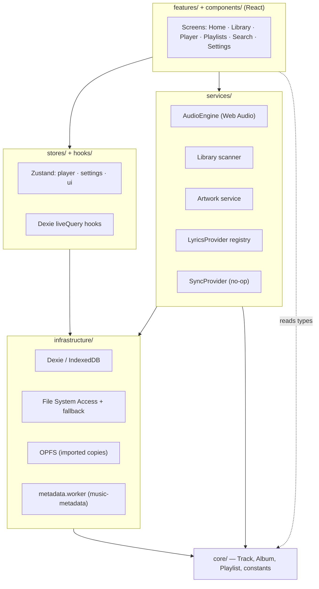
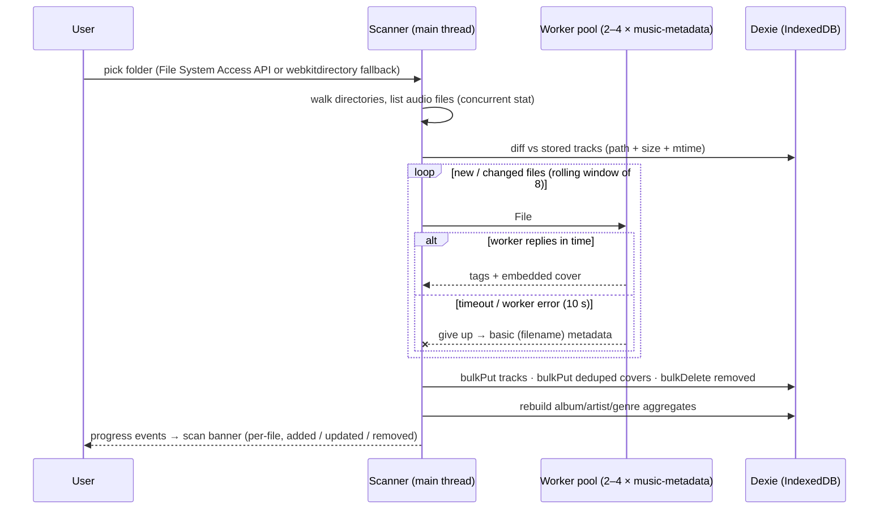
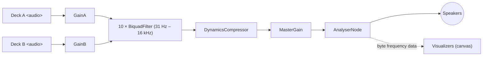

# Architecture

Aura Music follows a pragmatic Clean Architecture: **domain types** at the center, **infrastructure** (storage, file system, workers) and **services** (audio, scanning, playlists, lyrics, sync) around it, and **features** (screens) on the outside. Dependencies always point inward — UI knows services, services know infrastructure, nothing knows the UI.

## Layer map

## Scan pipeline

Folder scanning never blocks the UI: discovery walks the directory handles, metadata parsing fans out to a Web Worker pool, and results are batched into IndexedDB. Aggregate tables (albums / artists / genres) are rebuilt once at the end so list views stay O(list size), not O(library size).

- **Track identity** is a stable 53-bit hash of `folderId + relative path` — rescans update in place, and favorites/play-counts survive metadata changes.
- **Cover dedup**: embedded art is hashed by content, so a 12-track album stores its cover once.
- **Incremental**: unchanged files (same path, size, mtime) are never re-parsed.
- **Tag-only parsing**: metadata parsing does **not** request `duration` from music-metadata. For MP3s without a VBR header that flag forces a full-file frame scan, which turns a mobile folder scan into minutes-long (effectively hung) work. Duration is instead backfilled from the `<audio>` element the first time a track plays and persisted (`AudioEngine.backfillDuration`), so the library populates instantly.
- **Never freezes**: a stalled or crashed worker can't hang the scan. Each job has a 10 s timeout after which the track is stored with basic (filename) metadata and the scan moves on; when workers can't be constructed at all (older WebViews / strict CSPs) parsing falls back to the main thread — but a *timed-out* worker is never retried on the main thread, so a genuinely stuck parse can't freeze the UI. See `infrastructure/workers/metadataPool.ts`.
- **Online covers**: after each scan, albums still missing artwork get a throttled background lookup (iTunes Search → MusicBrainz/Cover Art Archive) with a Dexie negative cache (`services/artwork/onlineCovers.ts`).

### Fallback mode (mobile browsers without the File System Access API)

Chrome/Edge on desktop use `showDirectoryPicker` and persist the folder handle, so folders re-scan on demand. Most mobile browsers lack that API and use an `<input webkitdirectory>` selection instead: there is no persistent handle, so the picked `File`s live only in an in-memory session cache. To pick up newly added / changed / removed songs in such a folder the user must re-select it — surfaced as the **"Update folder"** (`reimportFallbackFolder`) refresh action next to each fallback folder in Settings. *Import into app* (OPFS) is recommended in this mode so playback survives reloads without re-picking.

## File resolution & the OPFS import

`getTrackFile` resolves audio in privilege order: **OPFS copy → session cache (fallback mode) → folder handle** (which may require a permission grant). The optional *Import into app* flow (`services/library/importer.ts`) copies a folder's files into the Origin Private File System at `/music/<folderId>/<path>`; imported folders play with zero permissions on every platform and are skipped by the permission banner. Rescans invalidate the copy only for files whose size/mtime changed.

## Audio graph

Two `HTMLAudioElement` "decks" share one processing chain. Crossfade ramps the deck gains against each other; the EQ, compressor (volume normalization) and analyser (visualizers) sit on the shared path so they apply seamlessly across track changes.

**Engine ↔ UI contract:** the engine is a plain singleton class (`services/audio/AudioEngine.ts`). It is the *only* writer of the player Zustand store; components subscribe to that store for rendering and call engine methods (`playTracks`, `seek`, `toggleShuffle`…) for intent. Settings changes (volume, EQ, crossfade, rate) reach the engine through a store subscription — no React lifecycle is involved in audio.

## Data model (IndexedDB via Dexie)

| Table           | Key            | Purpose                                                     |
| --------------- | -------------- | ----------------------------------------------------------- |
| `tracks`        | hash(path)     | One row per song; indexes on artist, album, genre, favorite, playCount, addedAt, lastPlayedAt |
| `covers`        | hash(bytes)    | Deduplicated embedded artwork blobs                          |
| `folders`       | auto           | Library roots; stores the `FileSystemDirectoryHandle` (structured-clonable) |
| `albums` / `artists` / `genres` | hash(name) | Materialized aggregates rebuilt after each scan |
| `playlists`     | random hash    | Ordered `trackIds[]`                                         |
| `playbackState` | `'current'`    | Queue, index, position, shuffle, repeat — restored on launch |
| `settings` (v2) | string key     | Generic key-value store (negative cache for cover lookups)   |

## Extension points

- **Lyrics** — `services/lyrics/types.ts` defines `LyricsProvider`; `services/lyrics/index.ts` holds an ordered registry. LRCLIB ships enabled (and powers the synced karaoke view in Now Playing); Musixmatch / lyrics.ovh are new files, not refactors.
- **Cloud sync** — `services/sync/types.ts` defines `SyncProvider` (`push`/`pull` of playlists, favorites, settings, history). The default is a no-op; a Supabase or Express/VPS implementation swaps in via one export.
- **Cover art providers** — `services/artwork/onlineCovers.ts` chains providers (iTunes → Cover Art Archive today); adding another source is one function in the chain.

## Performance

- `@tanstack/react-virtual` on every long list (songs view renders ~20 rows regardless of library size).
- Metadata parsing in workers; scan writes batched in Dexie transactions.
- Route-level code splitting (`React.lazy`) + manual vendor chunks.
- Object-URL cache for covers; memoized rows (`memo(TrackRow)`).
- Canvas visualizers draw at DPR ≤ 2 and pause work when the analyser is silent.

## GitHub Pages / PWA notes

- `base: '/Aura-music/'`, SPA deep links restored via `public/404.html` + a snippet in `main.tsx` ([spa-github-pages](https://github.com/rafgraph/spa-github-pages) technique).
- Workbox precaches the whole shell (~1.2 MB) with `navigateFallback`, so any route loads offline; audio never touches the network.
- **Build stamp**: `vite.config.ts` injects `__APP_VERSION__` (short git sha + build date). It's shown at the bottom of Settings and on the About page so a device running a stale service-worker cache can be identified at a glance — useful because the PWA can keep serving an old bundle until its data is cleared / it's reinstalled.
- **Deploying while Actions are unavailable**: `deploy.yml` publishes on every push to `main`, but if GitHub Actions is blocked (e.g. an account billing hold), Pages is configured as *Deploy from a branch → `gh-pages`*. Build locally (`npm run build`) and publish `dist/` to `gh-pages` (copy `dist/*`, add `.nojekyll`, commit, push). Pages rebuilds without touching Actions.
